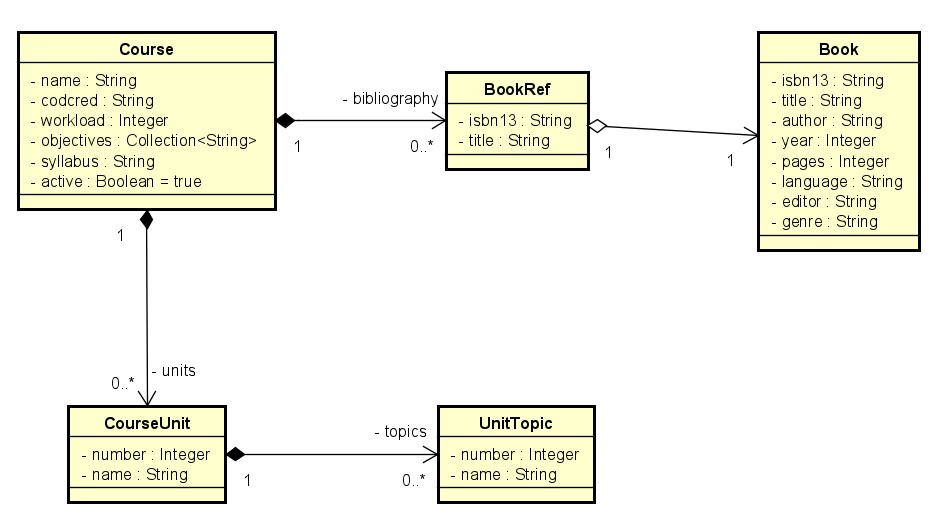

# Courses backend

Você vai precisar do [Docker](https://www.docker.com) instalado em sua máquina, rode o seguinte comando na raiz do projeto:

    docker-compose up

# Erros 

## CO-1XX (401 UNAUTHORIZED)

| CO-12X| Erro de autenticação na aplicação|
| ------ | :----------- |
| CO-121| Token inválido |

---

## CO-2XX (404 Not Found)

| CO-23X| Erro no formato da requisição do domínio |
| ------ | :----------- |
| CO-231| Recurso não encontrado |

---

## CO-3XX (400 Bad Request)
| CO-32X| Erro no formato da requisição da aplicação |
| ------ | :----------- |
| CO-320| Consulta inválida |

| CO-33X| Erro no formato da requisição do domínio |
| ------ | :----------- |
| CO-330| Consulta inválida |
| CO-331| Atributo inválido |
| CO-332| Livro inválido |
| CO-334| Erro de campo obrigatório nulo|

---

## CO-4XX (409 Conflict)

| CO-41X| Erros de conflito |
| ------ | ----------- | 
| CO-410| Chave duplicada | 

---

## CO-5XX (500 Internal Server Error)

| CO-51X| Erros na camada adaptadora |
| ------ | ----------- | 
| CO-510| Erro desconhecido | 
| CO-511| Erro desconhecido no repositório | 
| CO-512| Erro de conexão ao banco de dados | 

| CO-52X| Erros na camada de aplicação |
| ------ | ----------- | 
| CO-520| Erro desconhecido | 

| CO-53X| Erros do domínio |
| ------ | ----------- | 
| CO-530| Erro desconhecido | 

## Astah Class Diagram
